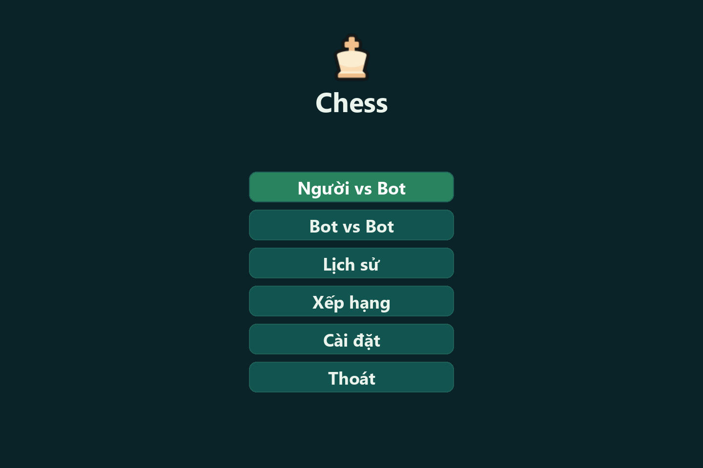
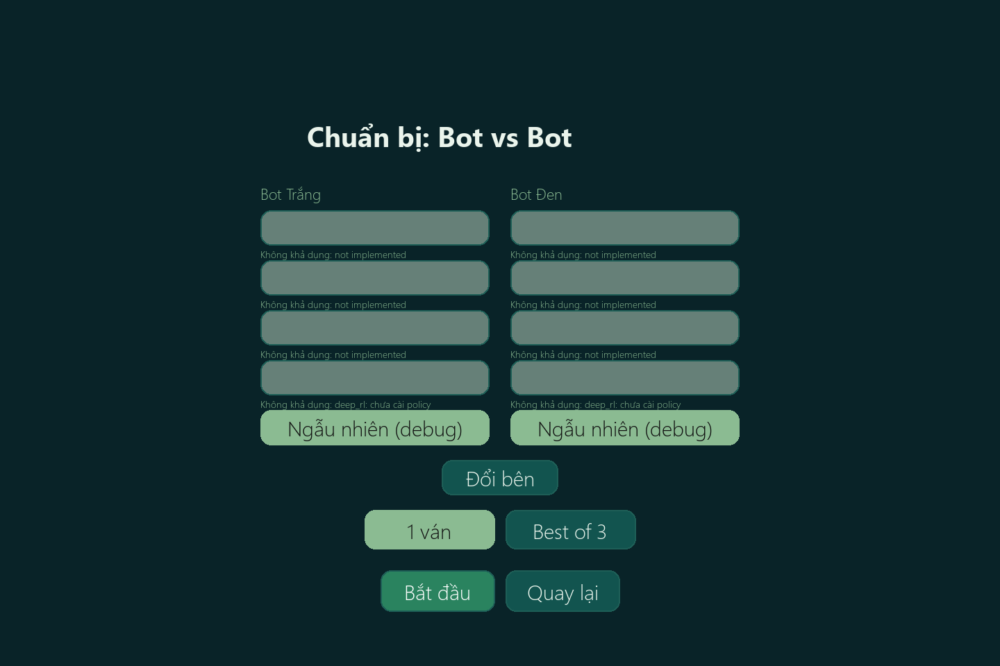
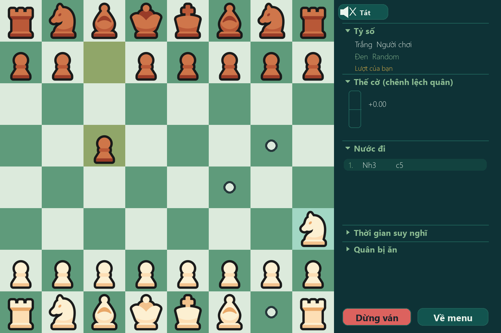
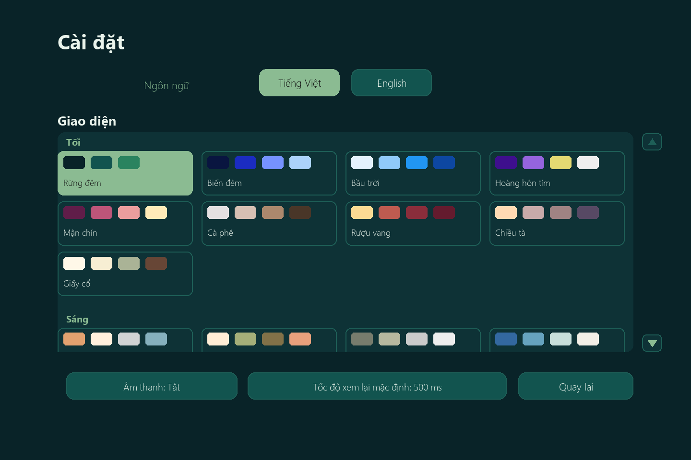

# Hướng dẫn sử dụng

## Menu

Menu chính có các lựa chọn **Người vs Bot**, **Bot vs Bot**, **Lịch sử**, **Xếp hạng**, **Cài đặt** và **Thoát**. Chọn một mục để mở màn hình tương ứng.

## Người vs Bot

Chọn một trong 8 bot (4 bot thành viên và 4 bot benchmark) đang khả dụng, sau đó chọn quân Trắng, Đen hoặc Ngẫu nhiên rồi bấm **Bắt đầu**. Bot màu xám chưa thể khởi tạo được; dòng bên dưới nút nêu lý do, thường là bot chưa triển khai hoặc thiếu trọng số cần thiết. Trên bàn cờ, chọn quân rồi chọn ô đến để đi; khi đi Tốt tới hàng cuối, chọn quân phong cấp trong hộp thoại.

## Bot vs Bot

Chọn bot Trắng và bot Đen độc lập trong 8 bot (có thể chọn cùng bot cho cả hai bên). Có thể đổi bên bằng nút hoán đổi, rồi chọn **1 ván** hoặc **Best of 3** trước khi bắt đầu. Khai cuộc ngẫu nhiên mặc định chỉ áp dụng cho chế độ này.

## Ván đấu

Bàn cờ nằm bên trái; panel bên phải trình bày thông tin ván và danh sách nước đi. Thông tin gồm lượt đi, nước gần nhất, kết quả/trạng thái và thời gian suy nghĩ. Danh sách nước đi hiển thị ký hiệu cờ và đánh dấu nước mới nhất. Thanh đánh giá biểu diễn **chênh lệch quân**, không phải đánh giá riêng của bot: trắng ở phía dương, đen ở phía âm.

Nút loa bật hoặc tắt âm thanh cho các nước đi, ăn quân, chiếu và kết thúc ván; mặc định tắt. Ở Bot vs Bot còn có tỷ số loạt, số ván trong loạt, **Tạm dừng/Tiếp tục** và nút xoay vòng độ trễ giữa các nước. **Dừng ván** hủy ván hiện tại và không ghi kết quả vào xếp hạng. Bot đang suy nghĩ không bị dừng tức thời; thao tác có hiệu lực sau nước hiện tại.

Ván kết thúc khi chiếu hết, hết nước (hòa), không đủ quân, lặp thế cờ 3 lần, luật 50 nước hoặc chạm giới hạn an toàn mặc định 300 nửa nước. Chi tiết và thứ tự kiểm tra được mô tả tại [CONTEXT.md §4.4](CONTEXT.md#44-luật-kết-thúc-ván).

## Lịch sử

Danh sách chứa tối đa 20 ván gần nhất, gồm hai bên, kết quả, lý do và ngày. Chọn một dòng để mở màn hình xem lại. Từ đây có thể xuất PGN; file được ghi vào `database/data/exports/`.

## Xem lại

Các nút điều khiển đưa ván về đầu, lùi một nửa nước, phát/tạm dừng, tiến một nửa nước hoặc tới cuối. Nút tốc độ thay đổi độ trễ phát; thanh đánh giá và danh sách nước cập nhật theo vị trí đang xem. **Xuất PGN** lưu bản ghi ván vào `database/data/exports/`.

## Xếp hạng

Bảng hiển thị thứ hạng, số ván, thắng, hòa, thua, điểm và Elo cho người chơi cùng 8 bot. Elo chỉ tính từ các ván Người vs Bot và Bot vs Bot; giải Xếp hạng AI không làm thay đổi Elo. Elo là điểm ước lượng sức chơi tương đối, bắt đầu ở 1200 theo cấu hình mặc định. Thắng làm điểm tăng nhiều hơn khi đối thủ mạnh hơn, còn thua làm điểm giảm; hòa thường chỉ điều chỉnh nhẹ. Nút **Đặt lại** yêu cầu xác nhận trước khi xóa dữ liệu xếp hạng.

## Cài đặt

- **Ngôn ngữ:** chọn Tiếng Việt hoặc English; thay đổi áp dụng ngay.
- **Âm thanh:** bật/tắt âm thanh; thiết lập đồng bộ với nút loa trong ván.
- **Chủ đề:** chọn trong 24 theme tối và sáng; cuộn danh sách, rê chuột để xem trước và bấm để áp dụng.
- **Tốc độ xem lại:** bấm nút để tăng độ trễ theo bước 500 ms; nút quay lại 500 ms sau mức 1000 ms. Giá trị được lưu làm mặc định.

## Dữ liệu và đặt lại

Dữ liệu ván và xếp hạng nằm trong `database/data/`: xếp hạng ở `database/data/ranking.json`, lịch sử ở `database/data/history/`, PGN xuất ở `database/data/exports/`. Cài đặt cá nhân được lưu trong `backend/config/local.toml`; file này chỉ ghi các giá trị ghi đè và không được commit. Để đặt lại dữ liệu, đóng game rồi xóa các tệp/thư mục tương ứng trong `database/data/`. Để khôi phục cài đặt mặc định, xóa `backend/config/local.toml`.

## Lỗi thường gặp

- **Cài PyTorch chậm:** lần cài đầu có thể mất vài phút vì gói PyTorch lớn; để `run.bat` hoàn tất và kiểm tra kết nối mạng.
- **Bot bị làm mờ:** bot không khởi tạo được. Đọc lý do hiện dưới tên bot; bot có thể chưa được triển khai hoặc thiếu checkpoint/trọng số.
- **Cửa sổ bị mờ:** trên Windows, cập nhật ứng dụng Python/Pygame và khởi động lại game; ứng dụng thiết lập DPI awareness trước khi khởi tạo Pygame. Nếu vẫn mờ, kiểm tra tùy chọn tương thích DPI của Windows cho Python.
- **Không tìm thấy Python:** cài Python 3.13 và bật Python Launcher (`py`), sau đó chạy lại `run.bat` từ thư mục dự án.

## Ảnh minh họa

Các ảnh dự kiến được kết xuất ở 1440×960, tiếng Việt, theme `dark_winter`:

